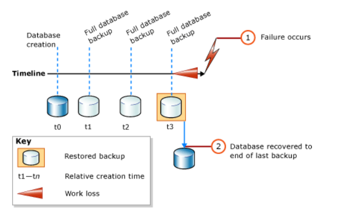
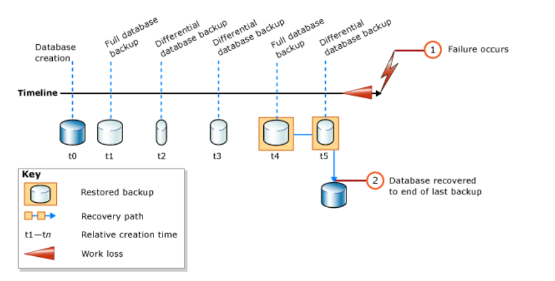

### 为什么要备份

从删库到跑路是数据库届流传已久的戏谑之言，但还是不断有人在这条路上负伤或者阵亡。为了防止数据真的丢失，备份是保护数据唯一的途径。

一般有3种备份还原的模式会遇到，下面挨个说明一下。

---

### 简单备份还原

简单模式下的完整数据库还原只涉及到一到两个restore语句，具体取决于是否要进行数据库差异备份。如果只使用完成备份，则只需还原最近的备份,如下图:



如果还需进行差异备份还原，则应还原最近的完整数据库备份而不还原数据库，然后还原最近的差异备份并还原数据库，如下图:



进行备份之前要先确认数据库当前的备份模式(simple or full)：

``` mssql
SELECT name, recovery_model_desc  FROM sys.databases   WHERE name = 'AdventureWorks2012' 
```

默认为简单备份模式，后面进行复杂恢复时需要进行修改。

这里以AdventureWorks2012数据库为例进行测试，

``` mssql
USE master;  
--Make sure the database is using the simple recovery model.  
ALTER DATABASE AdventureWorks2012 SET RECOVERY SIMPLE;  
GO  
-- Back up the full AdventureWorks2012 database.  
BACKUP DATABASE AdventureWorks2012   
TO DISK = 'C:\temp\AdventureWorks2012.bak'   
  WITH FORMAT;  
GO  
--Create a differential database backup.  
BACKUP DATABASE AdventureWorks2012   
TO DISK = 'C:\temp\AdventureWorks2012.bak'  
   WITH DIFFERENTIAL;  
GO  
--Restore the full database backup (from backup set 1).  
RESTORE DATABASE AdventureWorks2012   
FROM DISK = 'C:\temp\AdventureWorks2012.bak'   
   WITH FILE=1, NORECOVERY;  
--Restore the differential backup (from backup set 2).  
RESTORE DATABASE AdventureWorks2012
FROM DISK = 'C:\temp\AdventureWorks2012.bak'   
   WITH FILE=2, RECOVERY;  
GO
```

这里我们先将数据库的备份模式修改为简单模式，然后进行数据库完整备份，数据库差异备份。备份成功后，先进行还原数据库完整备份文件而不还原数据库，最后还原差异备份并还原数据库。是否还原数据库还是只还原备份取决于参数recovery和norecovery，二者区别在于使用norecovery还原之后数据库并没有进行还原数据库，数据库此时仍然是不可用的，可以继续进行其他的还原操作，但如果恢复完整备份时使用recovery参数，此时数据库已经可以使用，此时如果有其他操作，则差异备份的就无法恢复了，这一点在还原多个备份时尤其要注意。

### 将数据库恢复到故障点

通过使用完整模式备份，我们可以将数据库恢复到某个特定的备份点，在完整备份模式下，需要进行日志以及尾部日志的备份，首先将备份模式修改为完整模式：

``` mssql
ALTER DATABASE AdventureWorks2012 SET RECOVERY FULL
```

然后分别进行数据库完整备份，日志备份以及日志尾部备份：

``` mssql
BACKUP DATABASE AdventureWorks2012 TO DISK = 'C:\temp\AdventureWorks2012_Data.bck'; --完整备份
BACKUP LOG AdventureWorks2012 TO DISK = 'C:\temp\AdventureWorks2012_Log.bck';--日志例程备份

-- Step 1: Create a tail-log backup by using WITH NORECOVERY.  
BACKUP LOG AdventureWorks2012  
   TO DISK = 'C:\temp\AdventureWorks2012_Logtail.bck'  
   WITH NORECOVERY;  
GO  
```

其中日志尾部备份是指备份从上次日志备份起所产生的事务日志。

然后进行还原操作：

``` mssql
-- Step 2: Restore the full database backup.  
RESTORE DATABASE AdventureWorks2012  
   FROM DISK = 'C:\temp\AdventureWorks2012_Data.bck'  
   WITH NORECOVERY;  
GO  
-- Step 3: Restore the first transaction log backup.  
RESTORE LOG AdventureWorks2012  
   FROM DISK = 'C:\temp\AdventureWorks2012_Log.bck'  
   WITH NORECOVERY;  
GO  
-- Step 4: Restore the tail-log backup.  
RESTORE LOG AdventureWorks2012  
   FROM  DISK = 'C:\temp\AdventureWorks2012_Logtail.bck'  
   WITH NORECOVERY;  
GO 
-- Step 5: Recover the database.  
RESTORE DATABASE AdventureWorks2012  
   WITH RECOVERY;  
```

步骤为还原数据库完整备份，还原之前有过备份的事务日志备份，还原尾部日志备份，最后恢复数据库就可以将数据库还原到发生故障的点了。

### 将数据库还原到特定时间点

上面的两种备份只能将数据库恢复到备份的节点，而无法更灵活的恢复到之前有过备份的任意时间点，当完整模式下存在早于目标还原点的完整备份，就可以通过对之后每个日志备份的还原把数据库还原到目标时间点。这种还原一般涉及到多个日志备份的还原操作。

``` mssql
RESTORE DATABASE AdventureWorks2012 
   FROM disk='C:\temp\AdventureWorks2012_Data.bck' with NORECOVERY;  
RESTORE LOG AdventureWorks2012 
   FROM disk='C:\temp\AdventureWorks2012_Log.bck' with NORECOVERY, STOPAT = '08/27/2019 16:20';  
   RESTORE LOG AdventureWorks2012 
   FROM disk='C:\temp\AdventureWorks2012_Log2.bck' with NORECOVERY, STOPAT = '08/27/2019 16:20';  
RESTORE DATABASE AdventureWorks2012 WITH RECOVERY;   
```

第一步仍旧是进行数据库完整备份的还原但不还原数据库，目标的还原时间为'08/27/2019 16:20',存在两个日志备份集，分别将他们还原，并指定'STOPAT'参数为相同时间，最后恢复数据库即可。 