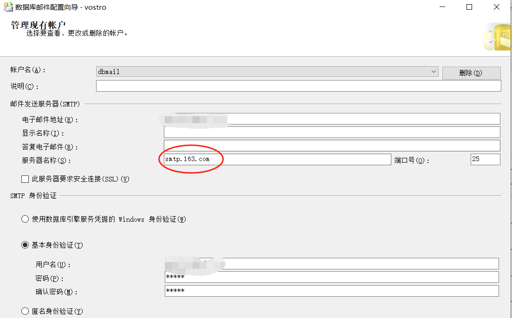
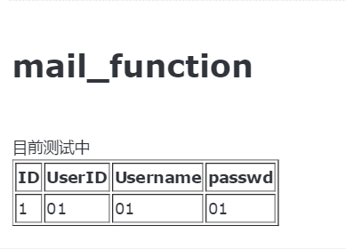

## 背景，要求
要求定期将SQL server数据库中的部分生产数据查询出来并通过邮件的形式发送给相应人员，涉及SQL server数据库邮件的配置，存储过程的调用。

---
## 功能配置
SQL server的数据库邮件功能默认是没有开启的，这里需要在对象资源管理器的管理菜单下找到数据库邮件，右键进入配置，主要是要创建配置文件以及和邮件相关的账户，账户创建：
这里需要注意的是邮箱的密码不能使用账户的登录密码，需要到对应的邮箱官网去设置授权码以实现本地客户端的登录。
执行完配置可以对结果进行测试，右键选择发送测试电子右键即可，可以通过查看邮件日志来观察发送情况：
``` sql
select * from msdb.dbo.sysmail_event_log
```
---
## 查询数据以特定格式发送
这里我们想要实现的是查询相应的数据并以一种方便查看的格式发送，发送邮件是调用"msdb.dbo.sp_send_dbmail"存储过程，可以发现里面有个body_format的参数可以用来设置邮件文本格式，一般选择html格式。执行存储过程代码如下：
``` sql
EXEC msdb.dbo.sp_send_dbmail 
    @profile_name = 'dbmailconfig',         --之前创建配置文件名称
    @recipients =  '',                      --收件email地址
    @subject = 'test',                      --邮件主题
	@body = @mailbody,                      --发送邮件正文
	@body_format = 'html'                   --邮件正文格式
```
"msdb.dbo.sp_send_dbmail"的参数非常多，但一般情况下使用这几个就足够了，接下来的难点就在于邮件正文的设计，难点主要在于如何将查询的内容插入到对应的节点，举一个小栗子：
``` sql
SET @mailbody = N'<H1>mail_function</H1><br>目前测试中<br><table border="1">' +
                N'<tr><th>ID</th><th>UserID</th><th>Username</th><th>passwd</th></tr>'  
                + CAST ((select  ID as 'td','',UserID as 'td','',UserName as 'td','',UserPassword as 'td',''
                from TraceabilitySensor.dbo.Users 
                FOR XML PATH('tr'), ELEMENTS) AS nvarchar(max)) ; 
```
这里我是将Users表的ID,UserID,UserNmae,UserPassword字段查询出并用表格的形式呈现，使用"FOR XML PATH"来查找对应节点，实际的结果长这样：

