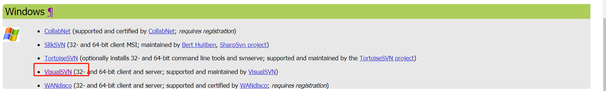
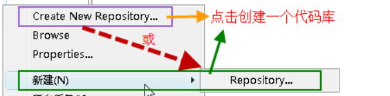
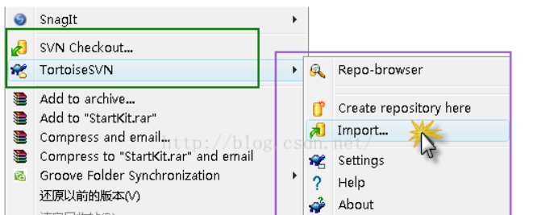
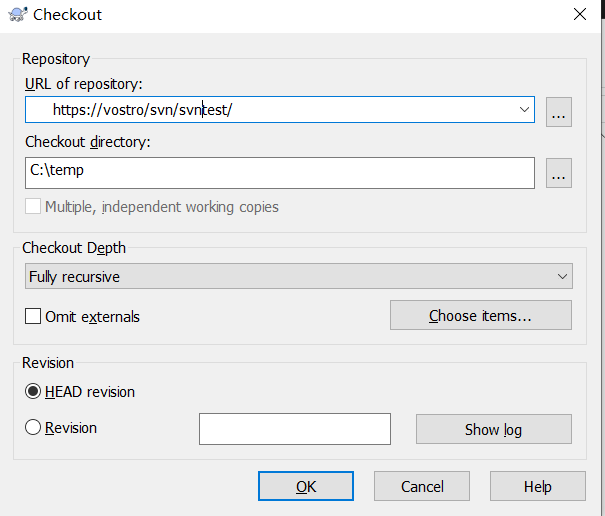
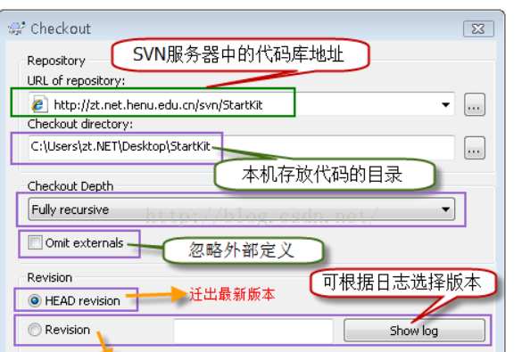

### 版本控制发展
1. 什么是版本控制：  
从字面上来理解版本控制就是用来管理版本的，版本库会帮助我们记录我们每一次修改提交的版本，这样我们可以恢复到以前的任一版本。而且当多人开发的时候他会帮我们把代码合并起来，而且可以记录每一个人的提交记录，这样出现问题之后可以很容易定位。  
2. 版本控制作用：  
   1. 数据备份
   2. 版本管理，避免版本混乱
   3. 提高多人开发效率
3. 版本控制工具发展史：  
   1. 本地版本控制
   - 用简单的数据库来记录文件的历次更新差异  
   - 只要整个项目的历史记录被保存在单一位置，就有丢失所有历史更新记录的风险  
   2. 集中化的版本控制系统(CVS,SVN)：  
   - 用单一的集中管理的服务器，来保存所有文件的修改版本，协同工作通过客户端连接到这台服务器，下载最新的代码或者提交更新  
   - 单如果中央服务器宕机了，那么宕机过程中服务无法使用，且中央服务器的数据没有备份而损坏所有记录就会丢失  
   3. 分布式版本控制(git等)：  
   - 分布式最大的特点是客户端并不只是提取最新版本的文件快照，而是把代码仓库完整的镜像下来，每个客户端其实都可以是中央服务器，当中央服务器损坏，从任何一个本地客户端都可以恢复  

### 选择SVN的原因：  
1. git使用有一定成本，对于初学者不友好；  
2. Windows服务器搭建git服务复杂，且不能很好解决ssh公钥问题；  
3. SVN使用简单，几乎所有操作都可以通过图形化客户端来完成；  
4. 使用局域网络搭建，方便管理。  

### SVN安装  
SVN属于C/S架构的管理工具，安装分为服务器端和客户端。  
1. 服务器端安装：  
VisualSVN下载地址：http://subversion.apache.org/packages.html  
  
下载后安装，选择安装目录，仓库存储目录，服务端口号(默认443端口)，完成后打开VisualSVN Server Manger,进行用户，仓库创建等操作  
2. 客户端安装：  
选择TortoiseSVN下载安装  

### 基本使用  
1. 服务端创建用户：  
- 在左侧User直接右键添加用户即可  
2. 服务端创建仓库：  
-   
- 选择创建空仓库，如果选择simple模式，则新建的仓库下会创建trunk,branches,tags三个子目录  
3. 迁入源代码到服务器仓库  
假设已经在服务器端创建了一个叫svntest的仓库，则可以在客户端主机的任意文件夹下右键点击Import选项，如下图：  
  
弹出如下界面：
  
其中URL of repository是svn server中代码库的根目录，尽量每次操作都在信息框中 填写操作日志  
4. 迁出源代码码到本机：  
在目标文件夹下右键单击checkout，弹出如下窗体：  
  
5. 提交修改过的文件到SVN服务器：  
tip：提交代码到服务器时，一定要确保本机的代码是最新版本，否则可能会提交失败或者产生冲突  
在本机仓库文件夹空白处右键点击SVN Commit即可提交更改，其中文件带有红色标识的是产生更改的文件  
6. 添加新文件到服务器：  
- 可以和正常提交更爱一样直接SVN Commit即可
- 或者先对添加的文件进行SVN ADD操作，但这一步操作并不是真正的把文件提交到服务器，而是加入了更新列表的缓存中，必须再次执行SVN Commit操作才能把代码提交到服务器  
7. 更新本机代码与服务器版本一致
- 执行SVN Update命令
- 更新操作可能会因为版本冲突而失败也可能文件正在被锁定  
8. 重命名文件或文件夹，并将修改提交到服务器：
- 在需要重命名的文件或者文件夹点击右键，点击TortiseSVN=>Rename,在弹出的窗体写入新名称即可  
- 不能直接使用Windows的重命名
9. 删除文件或文件夹，并将修改提交到服务器：
- 直接删除文件或文件夹，然后SVN Commit--不推荐
- 在要删除的文件或者文件夹右键Tortoise=>Delete,然后SVN Commit执行删除
10. 使用分支
- 分支原理：在SVN中创建分支实际上就是一个版本拷贝，而不是简单的拷贝一个文件目录 
- 创建方法：右键点击Branch/tag，选择路径即可

